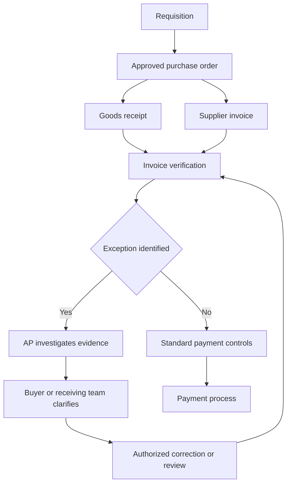

# Procurement process and exception ownership

This is a simplified material procurement example. Invoice and receipt timing can differ.
Actual SAP invoice behavior depends on PO settings, tolerances, process and product release.

| Step | Owner in this lab | Evidence | What it establishes |
|---|---|---|---|
| Requisition | Requester | Internal request | Need for goods |
| Purchase order | Buyer | PO and item | Agreed quantity and price |
| Goods receipt | Receiving team | Receipt record | Recorded received quantity |
| Invoice verification | AP analyst | Invoice and PO history | Variances requiring investigation |
| Exception review | Buyer or receiving team plus AP | Supporting evidence | Proposed resolution |
| Payment | Finance payment process | Approved due items and controls | Separate financial execution |

My explanation without notes: TODO
How my map differs from the real process I know: TODO
